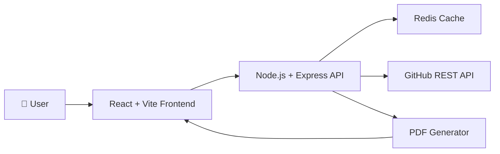
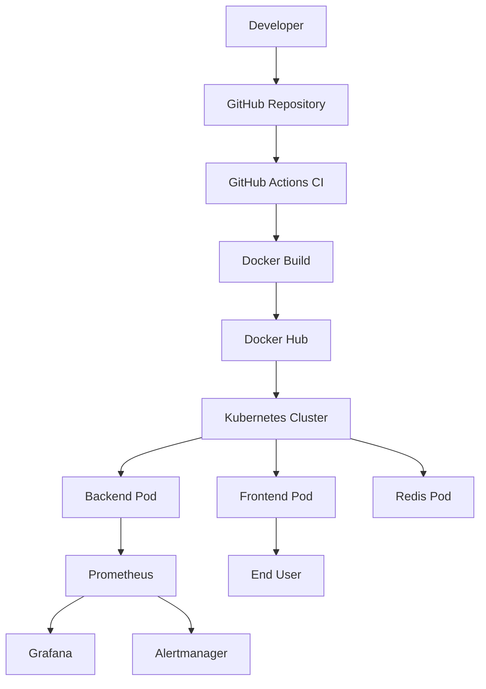
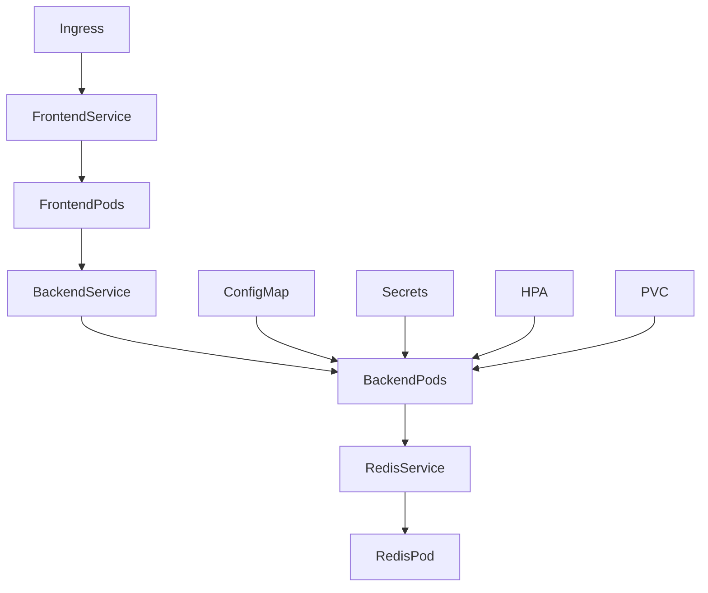
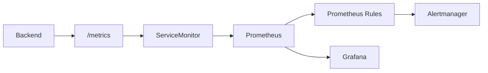
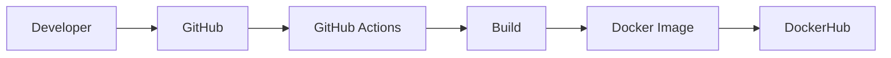
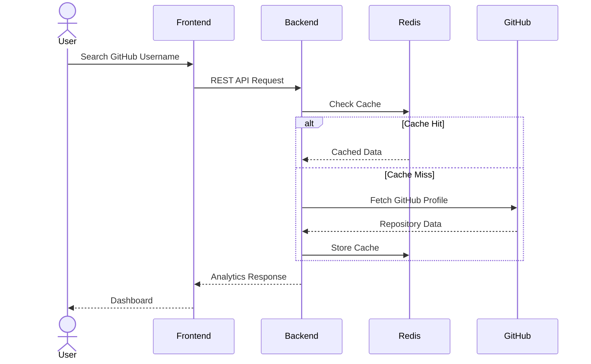
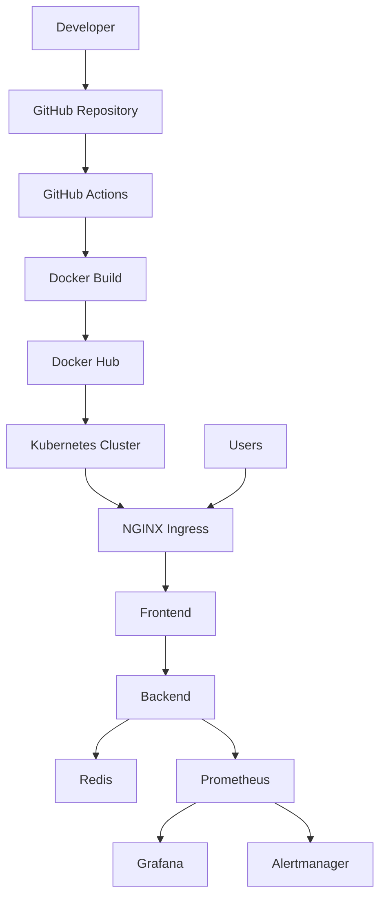
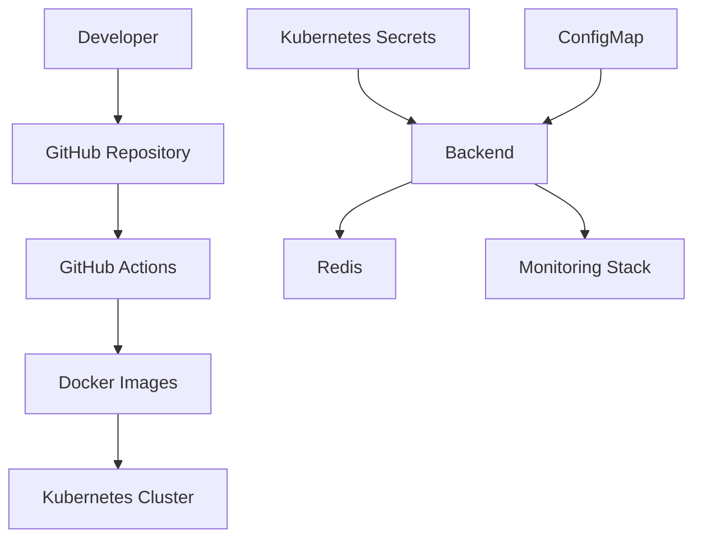
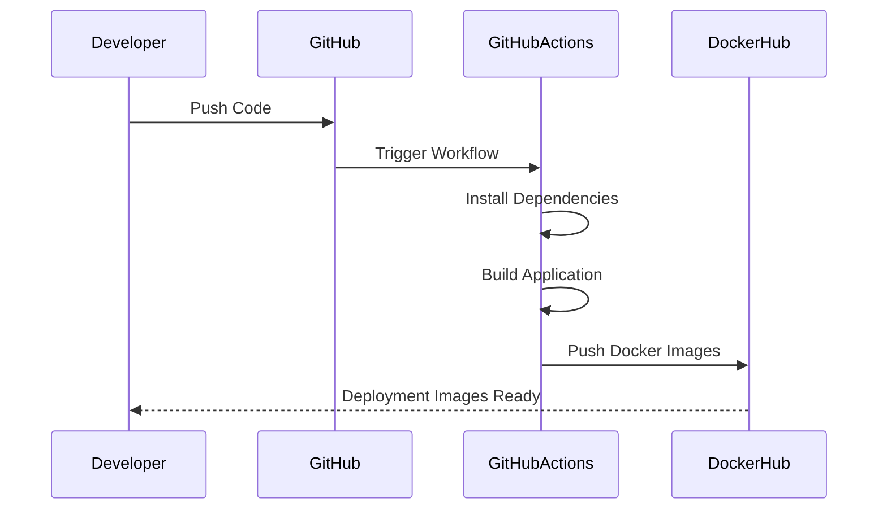

<div align="center">

# GitAnalyze AI

### Production-Ready GitHub Portfolio Intelligence Platform

Analyze • Audit • Score • Optimize • Monitor

---

<p align="center">

<!-- Add Badges Here -->


</p>

---

### GitAnalyze AI is a production-grade full-stack GitHub portfolio intelligence platform that analyzes public GitHub profiles, evaluates repository quality, calculates ATS readiness, recommends career paths, and demonstrates modern DevOps practices through containerization, Kubernetes orchestration, CI/CD automation, monitoring, alerting, and scalable cloud-native deployment.

</div>

---

# Demo

## Application Walkthrough

> **GIF Placeholder**

```
/assets/demo/demo.gif
```

---

## Live Preview

> Coming Soon

```
Oracle Cloud Deployment
```

---

# Screenshots

| Home Dashboard | Repository Audit |
|---------------|------------------|
| Screenshot | Screenshot |

| ATS Score | Career Analysis |
|------------|----------------|
| Screenshot | Screenshot |

| Company Fit | 30/60/90 Roadmap |
|-------------|-----------------|
| Screenshot | Screenshot |

| PDF Report | Monitoring Dashboard |
|------------|---------------------|
| Screenshot | Screenshot |

---

# Table of Contents

- Overview
- Features
- Technology Stack
- System Architecture
- Application Architecture
- DevOps Architecture
- CI/CD Pipeline
- Kubernetes Architecture
- Monitoring Stack
- DevSecOps
- Installation
- Local Development
- Docker Deployment
- Kubernetes Deployment
- Monitoring
- Security
- Performance Optimizations
- API Documentation
- Folder Structure
- Troubleshooting
- Future Roadmap
- Contributing
- License

---

# Overview

GitAnalyze AI is an engineering-focused GitHub portfolio intelligence platform designed to provide actionable insights for software developers.

Unlike conventional GitHub analyzers that display only repository statistics, GitAnalyze AI evaluates repository quality using engineering best practices including documentation quality, repository health, contribution activity, workflow automation, licensing, technology diversity, portfolio completeness, and career alignment.

The platform generates recruiter-oriented insights including:

- Repository Quality Assessment
- ATS Readiness Score
- Developer Strength Analysis
- Technology Distribution
- Career Role Matching
- Company Fit Analysis
- Portfolio Improvement Suggestions
- 30 / 60 / 90 Day Action Roadmap
- PDF Report Generation

In addition to application-level functionality, the project demonstrates production-oriented DevOps engineering practices including Docker, Kubernetes, Helm, GitHub Actions, Horizontal Pod Autoscaling (HPA), Prometheus, Grafana, Alertmanager, Redis caching, persistent storage, and cloud-native deployment strategies.

---

# Project Goals

The primary objective of this project is to combine Full Stack Development and Modern DevOps Engineering into a single production-ready application.

The project demonstrates:

- Building scalable frontend and backend services
- Implementing containerized deployments
- Kubernetes orchestration
- Continuous Integration
- Continuous Delivery
- Monitoring
- Alerting
- Performance optimization
- Cloud-native application design
# System Architecture

GitAnalyze AI follows a modular cloud-native architecture where the frontend, backend, caching layer, monitoring stack, and Kubernetes infrastructure are fully decoupled. Each component is independently deployable, scalable, and observable.



---

# Complete DevOps Architecture

The application is built using a modern DevOps workflow that automates source control, containerization, continuous integration, deployment, monitoring, and alerting.



---

# Kubernetes Architecture

The application is deployed inside Kubernetes using multiple Deployments and Services. Configuration is externalized using ConfigMaps and Secrets while Horizontal Pod Autoscaler provides automatic scaling.



---

# Monitoring Architecture

GitAnalyze AI includes a complete monitoring stack based on Prometheus Operator.



---

# Continuous Integration Pipeline

Every push automatically triggers the CI pipeline.



---

# High Level Deployment Flow

```text
Developer
     │
     ▼
GitHub Repository
     │
     ▼
GitHub Actions
     │
     ▼
Docker Build
     │
     ▼
Docker Hub
     │
     ▼
Kubernetes Cluster
     │
 ┌───────────────┐
 │               │
 ▼               ▼
Frontend      Backend
                  │
                  ▼
               Redis
                  │
                  ▼
           GitHub REST API
                  │
                  ▼
            Prometheus
                  │
        ┌─────────┴─────────┐
        ▼                   ▼
    Grafana          Alertmanager
```

---

# Engineering Decisions

| Decision | Reason |
|-----------|--------|
| React + Vite | Fast build and optimized bundle size |
| Express.js | Lightweight REST API framework |
| Redis | Reduce GitHub API calls and improve performance |
| Docker | Consistent containerized deployment |
| Kubernetes | High availability and orchestration |
| Helm | Simplified Kubernetes package management |
| GitHub Actions | Automated CI pipeline |
| Prometheus | Metrics collection |
| Grafana | Visualization dashboards |
| Alertmanager | Production alerting |
| HPA | Automatic scaling based on CPU utilization |
| ConfigMap | External configuration management |
| Secrets | Secure storage of sensitive data |
| PVC | Persistent Grafana and Prometheus data |

---

# Project Structure Overview

```text
GitAnalyze-AI
│
├── frontend/
│
├── backend/
│
├── k8s/
│   ├── namespace.yaml
│   ├── frontend-deployment.yaml
│   ├── backend-deployment.yaml
│   ├── redis-deployment.yaml
│   ├── ingress.yaml
│   ├── configmap.yaml
│   ├── secret.yaml
│   └── hpa.yaml
│
├── monitoring/
│   ├── grafana-values.yaml
│   ├── prometheus-values.yaml
│   ├── grafana-pvc.yaml
│   ├── prometheus-pvc.yaml
│   ├── alert-rules.yaml
│   └── alertmanager-config.yaml
│
├── .github/
│   └── workflows/
│
├── docker-compose.yml
│
├── Dockerfile
│
└── README.md
```
# Features

GitAnalyze AI combines Full Stack Development with modern DevOps practices to provide an end-to-end GitHub portfolio intelligence platform.

## Core Application Features

| Feature | Description |
|----------|-------------|
| GitHub Profile Analysis | Analyze any public GitHub profile using the GitHub REST API |
| Repository Health Audit | Evaluate repositories for documentation, workflows, licensing, releases, and engineering best practices |
| ATS Readiness Score | Calculate a recruiter-oriented portfolio score |
| Career Role Matching | Match developer profiles against Frontend, Backend, Full Stack, DevOps, and AI/ML roles |
| Company Fit Analysis | Estimate suitability for Product and Service based organizations |
| Portfolio Insights | Highlight strengths, weaknesses, and improvement opportunities |
| 30 / 60 / 90 Day Roadmap | Personalized learning roadmap generated from profile analysis |
| PDF Report Export | Generate downloadable reports directly from the browser |
| Intelligent Caching | Redis-backed caching with automatic in-memory fallback |

---

# DevOps Features

| Category | Implementation |
|----------|----------------|
| Containerization | Docker |
| Multi Container Environment | Docker Compose |
| Container Registry | Docker Hub |
| Continuous Integration | GitHub Actions |
| Kubernetes Orchestration | Kubernetes |
| Package Management | Helm |
| Namespace Isolation | Kubernetes Namespace |
| Configuration Management | ConfigMap |
| Secret Management | Kubernetes Secret |
| Persistent Storage | Persistent Volume Claims |
| Horizontal Scaling | Horizontal Pod Autoscaler |
| Health Monitoring | Liveness & Readiness Probes |
| Metrics Collection | Prometheus |
| Dashboard Visualization | Grafana |
| Alerting | Alertmanager |
| Application Monitoring | ServiceMonitor |
| Cache Layer | Redis |

---

# Technology Stack

## Frontend

| Technology | Purpose |
|------------|---------|
| React | User Interface |
| Vite | Build Tool |
| Tailwind CSS | Styling |
| Recharts | Analytics Visualization |
| React PDF | PDF Generation |

---

## Backend

| Technology | Purpose |
|------------|---------|
| Node.js | Runtime |
| Express.js | REST API |
| Redis | Caching |
| Node Cache | Redis Fallback |
| Axios | External API Communication |

---

## DevOps Stack

| Technology | Purpose |
|------------|---------|
| Docker | Containerization |
| Docker Compose | Local Multi-Container Development |
| Kubernetes | Container Orchestration |
| Helm | Kubernetes Package Management |
| GitHub Actions | CI Pipeline |
| Prometheus | Metrics Collection |
| Grafana | Monitoring Dashboards |
| Alertmanager | Production Alerting |
| Redis | Cache Layer |

---

# Project Directory Structure

```text
GitAnalyze-AI/

├── frontend/
│   ├── src/
│   ├── public/
│   ├── components/
│   ├── pages/
│   └── assets/
│
├── backend/
│   ├── controllers/
│   ├── routes/
│   ├── services/
│   ├── middleware/
│   ├── utils/
│   └── server.js
│
├── k8s/
│   ├── namespace.yaml
│   ├── deployments/
│   ├── services/
│   ├── ingress/
│   ├── configmap/
│   ├── secrets/
│   ├── hpa/
│   └── pvc/
│
├── monitoring/
│   ├── alert-rules.yaml
│   ├── grafana-values.yaml
│   ├── prometheus-values.yaml
│   ├── grafana-pvc.yaml
│   ├── prometheus-pvc.yaml
│   └── alertmanager-config.yaml
│
├── .github/
│   └── workflows/
│
├── docker-compose.yml
│
├── Dockerfile
│
└── README.md
```

---

# Application Workflow



---

# Performance Optimizations

GitAnalyze AI has been optimized for production workloads using modern frontend and backend optimization strategies.

### Frontend

- Lazy Loaded Components
- Dynamic Imports
- Optimized Bundle Splitting
- Lighthouse Performance Optimization
- Browser-side PDF Rendering
- Responsive Rendering

---

### Backend

- Redis Cache Layer
- Node Cache Fallback
- API Response Caching
- Reduced GitHub API Requests
- Express Rate Limiting
- Efficient JSON Processing

---

### Kubernetes

- Horizontal Pod Autoscaler
- Health Checks
- Rolling Updates
- Persistent Volumes
- Namespace Isolation
- ConfigMaps
- Secrets

---

# API Overview

| Endpoint | Description |
|-----------|-------------|
| GET /analyze/:username | Analyze GitHub profile |
| GET /health | Health Check Endpoint |
| GET /metrics | Prometheus Metrics |
| POST /cache/refresh | Refresh Redis Cache |

---

# Screenshots

## Dashboard

> Replace with Dashboard Screenshot

---

## Repository Analysis

> Replace with Repository Screenshot

---

## ATS Analysis

> Replace with ATS Screenshot

---

## Company Fit

> Replace with Company Fit Screenshot

---

## Career Matching

> Replace with Career Analysis Screenshot

---

## Monitoring Dashboard

> Replace with Grafana Screenshot

---

## Alertmanager

> Replace with Alertmanager Screenshot

---

## Kubernetes

> Replace with kubectl get pods Screenshot

# Installation Guide

This section explains how to deploy GitAnalyze AI in different environments, ranging from local development to a production-ready Kubernetes cluster.

---

# Prerequisites

Before getting started, ensure the following tools are installed.

| Tool | Version |
|-------|----------|
| Git | Latest |
| Node.js | >= 20 |
| Docker | Latest |
| Docker Compose | Latest |
| Kubernetes | >= 1.30 |
| Helm | >= 3 |
| kubectl | Latest |
| Redis | Optional |
| GitHub Personal Access Token | Required |

---

# Clone Repository

```bash
git clone https://github.com/Saurav6200907210/GitAnalyze-AI.git

cd GitAnalyze-AI
```

---

# Environment Variables

Create a `.env` file inside the backend directory.

```env
PORT=5000

GITHUB_TOKEN=YOUR_GITHUB_TOKEN

REDIS_HOST=redis

REDIS_PORT=6379

CACHE_TTL_SECONDS=3600
```

---

# Local Development

## Install Frontend

```bash
npm install
```

---

## Install Backend

```bash
cd backend

npm install
```

---

## Start Backend

```bash
npm run dev
```

---

## Start Frontend

```bash
cd ..

npm run dev
```

---

Application

```
http://localhost:5173
```

---

Backend

```
http://localhost:5000
```

---

# Docker Deployment

Build Backend

```bash
docker build -t gitanalyze-backend ./backend
```

Build Frontend

```bash
docker build -t gitanalyze-frontend .
```

Run Backend

```bash
docker run -p 5000:5000 gitanalyze-backend
```

Run Frontend

```bash
docker run -p 80:80 gitanalyze-frontend
```

---

# Docker Compose Deployment

Launch all services

```bash
docker compose up -d
```

Stop services

```bash
docker compose down
```

View logs

```bash
docker compose logs -f
```

Running Containers

```bash
docker ps
```

---

# Kubernetes Deployment

Apply Namespace

```bash
kubectl apply -f k8s/namespace.yaml
```

Deploy Application

```bash
kubectl apply -f k8s/
```

Verify Pods

```bash
kubectl get pods -n gitanalyze-ai
```

Verify Services

```bash
kubectl get svc -n gitanalyze-ai
```

Verify Deployments

```bash
kubectl get deployments -n gitanalyze-ai
```

Verify HPA

```bash
kubectl get hpa -n gitanalyze-ai
```

---

# Helm Deployment

Install kube-prometheus-stack

```bash
helm repo add prometheus-community https://prometheus-community.github.io/helm-charts

helm repo update

helm install monitoring prometheus-community/kube-prometheus-stack \
-n monitoring \
--create-namespace
```

Upgrade

```bash
helm upgrade monitoring prometheus-community/kube-prometheus-stack \
-n monitoring \
-f monitoring/grafana-values.yaml \
-f monitoring/prometheus-values.yaml
```

---

# Monitoring Stack

Verify Prometheus

```bash
kubectl get pods -n monitoring
```

Port Forward

Prometheus

```bash
kubectl port-forward svc/monitoring-kube-prometheus-prometheus \
-n monitoring \
9090:9090
```

Grafana

```bash
kubectl port-forward svc/monitoring-grafana \
-n monitoring \
3000:80
```

Alertmanager

```bash
kubectl port-forward svc/monitoring-kube-prometheus-alertmanager \
-n monitoring \
9093:9093
```

---

# Access URLs

| Service | URL |
|----------|-----|
| Frontend | http://localhost:5173 |
| Backend | http://localhost:5000 |
| Prometheus | http://localhost:9090 |
| Grafana | http://localhost:3000 |
| Alertmanager | http://localhost:9093 |

---

# Verification Commands

Pods

```bash
kubectl get pods -A
```

Services

```bash
kubectl get svc -A
```

Deployments

```bash
kubectl get deploy -A
```

Namespaces

```bash
kubectl get ns
```

Persistent Volume Claims

```bash
kubectl get pvc -A
```

Horizontal Pod Autoscaler

```bash
kubectl get hpa -A
```

Helm Releases

```bash
helm list -A
```

---

# Expected Deployment

```
Frontend
      │
      ▼
Backend API
      │
      ▼
Redis
      │
      ▼
GitHub REST API

↓

Prometheus

↓

Grafana

↓

Alertmanager
```

---

# Deployment Validation Checklist

| Component | Status |
|------------|---------|
| Frontend | ✅ |
| Backend | ✅ |
| Redis | ✅ |
| Docker | ✅ |
| Docker Compose | ✅ |
| Kubernetes | ✅ |
| Helm | ✅ |
| HPA | ✅ |
| Prometheus | ✅ |
| Grafana | ✅ |
| Alertmanager | ✅ |
| PVC | ✅ |

---

# Troubleshooting

## Pods not starting

```bash
kubectl describe pod POD_NAME
```

---

## View Logs

```bash
kubectl logs POD_NAME
```

---

## Restart Deployment

```bash
kubectl rollout restart deployment/backend-deployment \
-n gitanalyze-ai
```

---

## Restart Prometheus

```bash
kubectl rollout restart statefulset/prometheus-monitoring-kube-prometheus-prometheus \
-n monitoring
```

---

## Restart Grafana

```bash
kubectl rollout restart deployment/monitoring-grafana \
-n monitoring
```

---

## Restart Alertmanager

```bash
kubectl rollout restart statefulset/alertmanager-monitoring-kube-prometheus-alertmanager \
-n monitoring
```

# DevOps Implementation

GitAnalyze AI follows a cloud-native DevOps architecture where every application component is independently deployable, observable, scalable, and maintainable.

The infrastructure is designed around Kubernetes best practices with automated CI/CD, containerized workloads, centralized monitoring, and production-ready alerting.

---

# DevOps Architecture



---

# Containerization Strategy

The application is fully containerized using Docker.

Each service runs in its own isolated container.

| Container | Responsibility |
|------------|----------------|
| Frontend | React + Vite application |
| Backend | Express REST API |
| Redis | Caching Layer |

Benefits

- Environment consistency
- Easy deployment
- Dependency isolation
- Fast scaling
- Simplified CI/CD

---

# Docker Compose

Docker Compose is used for local development.

Services started together

- Frontend
- Backend
- Redis

Benefits

- Single command startup

```bash
docker compose up -d
```

- Local production simulation
- Simplified developer workflow

---

# Continuous Integration

Every push to the repository automatically triggers the GitHub Actions pipeline.

Pipeline Stages

```text
Git Push

↓

Checkout Repository

↓

Install Dependencies

↓

Build Application

↓

Build Docker Images

↓

Push Docker Images

↓

Deployment Ready
```

Current Pipeline Features

- Automatic Build
- Docker Image Creation
- Docker Hub Integration
- Build Verification

---

# Kubernetes Deployment Strategy

Every application component is deployed independently.

| Resource | Purpose |
|-----------|----------|
| Namespace | Resource isolation |
| Deployment | Pod lifecycle management |
| Service | Internal communication |
| ConfigMap | Application configuration |
| Secret | Sensitive configuration |
| Ingress | External access |
| HPA | Automatic scaling |
| PVC | Persistent storage |

---

# Namespace Design

All application resources are isolated inside

```text
gitanalyze-ai
```

Monitoring stack is isolated inside

```text
monitoring
```

This separation improves

- Security
- Resource management
- Observability
- Maintenance

---

# High Availability Strategy

GitAnalyze AI follows Kubernetes deployment best practices.

Features

- Rolling Updates
- Self-Healing Pods
- Replica Management
- Automatic Restart
- Horizontal Scaling

---

# Horizontal Pod Autoscaler

The backend automatically scales according to CPU utilization.

```text
Current CPU

↓

HPA

↓

Increase Replicas

↓

Traffic Distributed

↓

CPU Stabilized
```

Current Configuration

| Setting | Value |
|----------|-------|
| Minimum Pods | 1 |
| Maximum Pods | 5 |
| Target CPU | 70% |

---

# Health Checks

The backend exposes health endpoints for Kubernetes.

Implemented

- Liveness Probe
- Readiness Probe

Benefits

- Detect unhealthy containers
- Automatic recovery
- Zero downtime deployment

---

# Configuration Management

Application configuration is separated from application code.

ConfigMap stores

- Environment variables
- Configuration values

Secrets store

- Sensitive credentials
- API Keys

Benefits

- Secure configuration
- Easy updates
- Environment portability

---

# Caching Strategy

GitAnalyze AI minimizes GitHub API requests using Redis.

Workflow

```text
User Request

↓

Backend

↓

Redis

↓

Cache Hit ?

↓

YES → Return Cached Data

↓

NO

↓

GitHub API

↓

Store in Redis

↓

Return Response
```

Fallback

If Redis becomes unavailable,

Node Cache automatically serves cached responses.

Benefits

- Lower GitHub API usage
- Faster response time
- Better user experience
- Reduced latency

---

# Monitoring Stack

Application monitoring is powered by Prometheus Operator.

Components

| Component | Purpose |
|------------|----------|
| Prometheus | Metrics Collection |
| Grafana | Dashboard Visualization |
| Alertmanager | Alert Routing |
| ServiceMonitor | Metrics Discovery |

---

# Metrics Collection

The backend exposes

```text
/metrics
```

Prometheus scrapes metrics using ServiceMonitor.

Collected Metrics

- HTTP Requests
- Response Time
- CPU Usage
- Memory Usage
- Process Metrics

---

# Alerting Strategy

Prometheus continuously evaluates alert rules.

Implemented Alerts

| Alert | Description |
|---------|-------------|
| BackendDown | Backend unavailable |
| HighCPUUsage | High CPU utilization |
| HighMemoryUsage | High memory usage |

Alert Flow

```text
Backend

↓

Metrics

↓

Prometheus

↓

Alert Rules

↓

Alertmanager

↓

Notification
```

---

# Persistent Storage

Persistent Volume Claims are used for

| Service | Storage |
|----------|----------|
| Grafana | Dashboard persistence |
| Prometheus | Metrics persistence |

Benefits

- Dashboards survive restarts
- Historical metrics retained
- Production-ready monitoring

---

# Security Practices

Current implementation includes

- Kubernetes Secrets
- Namespace Isolation
- ConfigMap Separation
- Non-hardcoded configuration
- Docker image isolation

Planned

- Trivy
- Gitleaks
- CodeQL
- Image vulnerability scanning

---

# Engineering Highlights

✔ Containerized architecture

✔ Kubernetes-native deployment

✔ Helm-based monitoring stack

✔ Horizontal auto scaling

✔ Persistent monitoring storage

✔ Redis intelligent caching

✔ Production health checks

✔ Custom Prometheus metrics

✔ Grafana dashboards

✔ Alertmanager integration

✔ CI/CD automation

✔ Cloud-ready architecture

# Security & DevSecOps

GitAnalyze AI follows a security-first approach by separating application configuration, infrastructure resources, and runtime secrets. Sensitive information is never hardcoded into the application source code.

---

# Security Architecture



---

# Current Security Practices

The current implementation includes several production-oriented security practices.

| Security Practice | Status |
|-------------------|--------|
| Kubernetes Secrets | ✅ |
| ConfigMap Separation | ✅ |
| Namespace Isolation | ✅ |
| Environment Variables | ✅ |
| Git Ignore Sensitive Files | ✅ |
| Health Checks | ✅ |
| Persistent Volume Isolation | ✅ |
| Container Isolation | ✅ |

---

# Configuration Management

Application configuration is externalized from the application code.

Configuration is managed through:

- Kubernetes ConfigMaps
- Kubernetes Secrets
- Environment Variables

This allows different environments to maintain independent configuration without modifying application source code.

---

# Secret Management

Sensitive values are never committed directly into source control.

Examples include:

- GitHub Personal Access Token
- Redis Credentials
- SMTP Credentials
- Database Credentials

These values are expected to be supplied through Kubernetes Secrets or local environment variables.

---

# Environment Isolation

The project separates application workloads into dedicated namespaces.

| Namespace | Purpose |
|-----------|----------|
| gitanalyze-ai | Application Workloads |
| monitoring | Monitoring Stack |

Benefits

- Better isolation
- Easier maintenance
- Improved security
- Simplified RBAC integration (future)

---

# Network Design

Communication between services happens through Kubernetes Services.

```text
Frontend

↓

Backend Service

↓

Backend Pod

↓

Redis Service

↓

Redis Pod
```

Only required services are exposed externally.

---

# Container Security

Docker containers are isolated from the host environment.

Current best practices include:

- Separate frontend/backend containers
- Independent Redis container
- Environment variable injection
- External configuration

---

# Monitoring Security

Monitoring components are deployed separately.

Included components

- Prometheus
- Grafana
- Alertmanager

Persistent storage is isolated using Persistent Volume Claims.

---

# Security Roadmap

The following DevSecOps features are planned for future releases.

| Feature | Planned |
|----------|----------|
| Trivy Image Scan | ⏳ |
| Trivy Filesystem Scan | ⏳ |
| Kubernetes Manifest Scan | ⏳ |
| Gitleaks Secret Scan | ⏳ |
| GitHub CodeQL | ⏳ |
| SBOM Generation | ⏳ |
| Dependency Scanning | ⏳ |
| Image Signing | ⏳ |

---

# Planned DevSecOps Pipeline

```mermaid
flowchart LR

Developer

↓

GitHub

↓

GitHub Actions

↓

Dependency Scan

↓

Secret Scan

↓

Container Scan

↓

Build Docker Image

↓

Push Image

↓

Deploy Kubernetes
```

---

# Future Security Enhancements

Future versions of GitAnalyze AI will include:

- Automated vulnerability scanning
- Secret detection during CI
- Dependency analysis
- Container image scanning
- Kubernetes manifest scanning
- Supply chain security
- Software Bill of Materials (SBOM)
- Signed container images

---

# Security Principles

The project follows the following engineering principles.

- Configuration outside application code
- Infrastructure as Code
- Immutable container images
- Principle of least privilege
- Secure secret handling
- Reproducible deployments
- Observability-first infrastructure

---

# Security Summary

GitAnalyze AI is designed with production-oriented deployment practices and establishes a strong foundation for integrating a complete DevSecOps workflow in future iterations.

The current implementation focuses on secure configuration management, workload isolation, observability, and Kubernetes-native deployment while maintaining compatibility with future security automation tools such as Trivy, Gitleaks, and GitHub CodeQL.
# Continuous Integration (CI)

GitAnalyze AI uses GitHub Actions to automate build verification and container image creation. Every change pushed to the repository is validated through an automated CI pipeline, reducing manual effort and ensuring consistent builds.

---

# CI/CD Workflow

```mermaid
flowchart LR

Developer["Developer"]

Commit["Git Commit"]

Push["Git Push"]

GitHub["GitHub Repository"]

Actions["GitHub Actions"]

Checkout["Checkout Source"]

Dependencies["Install Dependencies"]

Build["Build Application"]

Docker["Build Docker Images"]

DockerHub["Push to Docker Hub"]

Developer --> Commit

Commit --> Push

Push --> GitHub

GitHub --> Actions

Actions --> Checkout

Checkout --> Dependencies

Dependencies --> Build

Build --> Docker

Docker --> DockerHub
```



---

# Pipeline Stages

| Stage | Description |
|---------|-------------|
| Source Checkout | Downloads the latest repository |
| Dependency Installation | Installs frontend and backend dependencies |
| Application Build | Validates production build |
| Docker Build | Builds frontend and backend images |
| Docker Image Validation | Ensures successful image creation |
| Docker Hub Push | Publishes images for deployment |

---

# Build Automation

Every push to the main branch automatically triggers:

- Repository Checkout
- Dependency Installation
- Application Build
- Docker Image Build
- Docker Hub Image Push

This minimizes manual deployment work and guarantees reproducible container images.

---

# Docker Image Strategy

The application is split into independent container images.

| Image | Purpose |
|--------|----------|
| Frontend Image | React + Vite Application |
| Backend Image | Express API |
| Redis Image | Official Redis Image |

Benefits

- Independent deployments
- Easier rollback
- Faster updates
- Better scalability

---

# Branching Strategy

Current workflow

```text
Feature Development

↓

Local Testing

↓

Git Commit

↓

Push to Main

↓

GitHub Actions

↓

Docker Build

↓

Docker Hub
```

Future enhancement

```text
Feature Branch

↓

Pull Request

↓

Automatic CI

↓

Review

↓

Merge

↓

Deployment
```

---

# Deployment Workflow



---

# Release Strategy

Current release process

1. Develop features locally
2. Commit changes
3. Push to GitHub
4. Automatic CI execution
5. Docker image generation
6. Docker Hub publication
7. Ready for Kubernetes deployment

---

# Repository Automation

The project currently automates:

| Automation | Status |
|------------|--------|
| Build Verification | ✅ |
| Docker Build | ✅ |
| Docker Hub Push | ✅ |
| Container Packaging | ✅ |

---

# Future CI/CD Enhancements

The following improvements are planned.

| Feature | Planned |
|----------|----------|
| Automated Kubernetes Deployment | ⏳ |
| Helm Release Automation | ⏳ |
| ArgoCD GitOps | ⏳ |
| Canary Deployment | ⏳ |
| Blue/Green Deployment | ⏳ |
| Rollback Automation | ⏳ |

---

# CI/CD Benefits

The automated workflow provides:

- Faster builds
- Consistent deployments
- Reproducible container images
- Reduced manual effort
- Production-ready release process

---

# Engineering Decisions

GitHub Actions was selected because it integrates directly with GitHub repositories, supports container workflows, and simplifies CI automation without requiring additional infrastructure.

The CI pipeline focuses on:

- Reliability
- Repeatability
- Simplicity
- Automation
- Production readiness

# Performance & Optimization

GitAnalyze AI has been optimized for production workloads using modern frontend optimization techniques, intelligent backend caching, and Kubernetes-native scalability.

---

# Performance Benchmarks

| Metric | Result |
|---------|---------|
| Initial Bundle Size | ~198 KB |
| Lighthouse Performance | 95+ |
| Lighthouse Accessibility | 100 |
| Lighthouse Best Practices | 100 |
| Lighthouse SEO | 100 |
| Dockerized Deployment | Yes |
| Kubernetes Ready | Yes |
| Monitoring Enabled | Yes |

---

# Frontend Optimizations

Implemented optimizations include

- Code Splitting
- Lazy Loading
- Dynamic Imports
- Tree Shaking
- Optimized Bundle Size
- Browser-side PDF Rendering
- Responsive UI
- Component-level Rendering Optimization

---

# Backend Optimizations

Implemented optimizations include

- Redis Cache
- Node Cache Fallback
- Response Caching
- API Request Reduction
- GitHub Rate Limit Optimization
- Express Middleware Optimization

---

# Infrastructure Optimizations

Current infrastructure supports

- Horizontal Pod Autoscaling
- Rolling Updates
- Kubernetes Health Checks
- Persistent Monitoring Storage
- Container Isolation
- Namespace Isolation

---

# Why These Technologies?

## Why React?

- Component-based architecture
- Fast rendering
- Rich ecosystem
- Excellent developer experience

---

## Why Express?

- Lightweight REST API
- Large ecosystem
- Middleware support
- Easy integration

---

## Why Redis?

GitHub API has request limits.

Redis reduces unnecessary requests by caching frequently accessed profile data.

Benefits

- Faster responses
- Reduced API usage
- Better scalability

---

## Why Docker?

Docker provides

- Environment consistency
- Easy deployment
- Simplified collaboration
- Reproducible builds

---

## Why Kubernetes?

Kubernetes enables

- Automatic restart
- Auto Scaling
- Rolling Updates
- Self Healing
- Production Deployment

---

## Why Helm?

Helm simplifies Kubernetes package management.

Instead of manually deploying dozens of Kubernetes resources, monitoring components can be installed and upgraded using a single command.

---

## Why Prometheus?

Prometheus collects

- CPU Metrics
- Memory Metrics
- Request Metrics
- Process Metrics

Benefits

- Reliable monitoring
- Time-series storage
- Powerful query language

---

## Why Grafana?

Grafana converts raw metrics into meaningful dashboards.

Benefits

- Visualization
- Monitoring
- Dashboarding
- Real-time Metrics

---

## Why Alertmanager?

Alertmanager continuously evaluates Prometheus alerts.

Capabilities

- Alert Routing
- Alert Grouping
- Alert Deduplication
- Notification Integration

---

# Screenshot Gallery

## Landing Page

> Replace with Landing Page Screenshot

---

## GitHub Profile Analysis

> Replace with Screenshot

---

## Repository Health Audit

> Replace with Screenshot

---

## ATS Readiness Score

> Replace with Screenshot

---

## Career Matching

> Replace with Screenshot

---

## Company Fit

> Replace with Screenshot

---

## 30 / 60 / 90 Day Roadmap

> Replace with Screenshot

---

## PDF Report

> Replace with Screenshot

---

## Docker Containers

> Replace with Screenshot

---

## Docker Compose

> Replace with Screenshot

---

## Kubernetes Pods

> Replace with Screenshot

---

## Kubernetes Services

> Replace with Screenshot

---

## Horizontal Pod Autoscaler

> Replace with Screenshot

---

## Grafana Dashboard

> Replace with Screenshot

---

## Prometheus Targets

> Replace with Screenshot

---

## Alertmanager

> Replace with Screenshot

---

## Persistent Volume Claims

> Replace with Screenshot

---

## GitHub Actions

> Replace with Screenshot

---

# Demonstration

## Application Walkthrough

> Replace with GIF

```
assets/demo/application-demo.gif
```

---

## Kubernetes Deployment

> Replace with GIF

```
assets/demo/kubernetes-demo.gif
```

---

## Monitoring Demo

> Replace with GIF

```
assets/demo/monitoring-demo.gif
```

---

## CI/CD Pipeline Demo

> Replace with GIF

```
assets/demo/github-actions-demo.gif
```

---

# Engineering Highlights

The project demonstrates practical implementation of

- Production-ready Docker workflows
- Kubernetes-native deployments
- Helm package management
- Continuous Integration
- Horizontal Auto Scaling
- Persistent Volumes
- Prometheus Monitoring
- Grafana Visualization
- Alertmanager Integration
- Redis-based Caching
- Health Checks
- Service Monitoring
- Cloud-ready Architecture

---

# Key Engineering Decisions

| Problem | Solution |
|----------|----------|
| GitHub API Rate Limits | Redis Cache |
| Manual Deployment | Docker + Kubernetes |
| Service Discovery | Kubernetes Services |
| Monitoring | Prometheus |
| Visualization | Grafana |
| Alerting | Alertmanager |
| Scaling | HPA |
| Configuration | ConfigMaps |
| Secret Storage | Kubernetes Secrets |
| Persistent Data | PVC |
| Package Management | Helm |

---

# Project Statistics

| Category | Count |
|-----------|------:|
| Docker Images | 2 |
| Kubernetes Deployments | 3 |
| Kubernetes Services | 3 |
| ConfigMaps | 1 |
| Secrets | 1 |
| HPA | 1 |
| Monitoring Stack | 3 Components |
| Alert Rules | 3+ |
| Persistent Volume Claims | 2 |
| GitHub Actions Workflows | 1 |

# API Documentation

GitAnalyze AI exposes a REST API that powers the frontend dashboard, repository analysis, monitoring, and health checks.

---

## Base URL

```text
http://localhost:5000
```

---

## Analyze GitHub Profile

```http
GET /analyze/:username
```

### Description

Analyzes a public GitHub profile and generates repository insights, ATS score, company fit analysis, and career recommendations.

### Example

```http
GET /analyze/torvalds
```

### Response

```json
{
  "username": "torvalds",
  "score": 91,
  "repositories": [],
  "careerMatch": {},
  "roadmap": {}
}
```

---

## Health Endpoint

```http
GET /health
```

Used by Kubernetes Liveness and Readiness probes.

Response

```json
{
  "status":"ok"
}
```

---

## Metrics Endpoint

```http
GET /metrics
```

Used by Prometheus.

Exposes

- Process Metrics
- Memory Usage
- CPU Usage
- HTTP Metrics

---

## Refresh Cache

```http
POST /cache/refresh
```

Refreshes Redis cache for a GitHub profile.

---

# Kubernetes Resources

| Resource | Purpose |
|----------|----------|
| Namespace | Application Isolation |
| Deployment | Pod Management |
| Service | Internal Networking |
| ConfigMap | Configuration |
| Secret | Sensitive Configuration |
| HPA | Auto Scaling |
| Ingress | External Access |
| PVC | Persistent Storage |

---

# Monitoring Components

| Component | Purpose |
|-----------|---------|
| Prometheus | Metrics Collection |
| Grafana | Dashboard Visualization |
| Alertmanager | Alert Routing |
| ServiceMonitor | Metrics Discovery |

---

# Current Project Status

| Module | Status |
|----------|--------|
| Full Stack Application | ✅ |
| Docker | ✅ |
| Docker Compose | ✅ |
| Redis | ✅ |
| GitHub Actions | ✅ |
| Kubernetes | ✅ |
| Helm | ✅ |
| Prometheus | ✅ |
| Grafana | ✅ |
| Alertmanager | ✅ |
| HPA | ✅ |
| Persistent Volumes | ✅ |
| Custom Metrics | ✅ |
| Custom Alerts | ✅ |
| DevSecOps | 🚧 Planned |
| Oracle Cloud Deployment | 🚧 Planned |

---

# Future Roadmap

## Cloud

- [ ] Oracle Cloud Deployment
- [ ] k3s Cluster
- [ ] Public URL
- [ ] HTTPS
- [ ] Domain Mapping

---

## DevSecOps

- [ ] Trivy Image Scan
- [ ] Trivy Filesystem Scan
- [ ] Gitleaks
- [ ] GitHub CodeQL
- [ ] SBOM Generation

---

## GitOps

- [ ] ArgoCD
- [ ] Automatic Kubernetes Deployment

---

## Observability

- [ ] Loki
- [ ] Promtail
- [ ] Distributed Tracing

---

# FAQ

## Why Redis?

Redis minimizes GitHub API requests and improves application response time.

---

## Why Kubernetes?

Kubernetes provides container orchestration, automatic recovery, rolling updates, and horizontal scaling.

---

## Why Helm?

Helm simplifies installation and lifecycle management of Kubernetes applications.

---

## Why Prometheus?

Prometheus provides time-series metrics collection for application monitoring.

---

## Why Grafana?

Grafana visualizes infrastructure and application metrics through dashboards.

---

## Why Alertmanager?

Alertmanager processes Prometheus alerts and routes them to notification channels.

---

# Contributing

Contributions are welcome.

Steps

```text
Fork Repository

↓

Create Feature Branch

↓

Commit Changes

↓

Push Branch

↓

Open Pull Request
```

---

# Troubleshooting

## Pods not starting

```bash
kubectl describe pod POD_NAME
```

---

## Pod Logs

```bash
kubectl logs POD_NAME
```

---

## Restart Backend

```bash
kubectl rollout restart deployment/backend-deployment \
-n gitanalyze-ai
```

---

## Restart Monitoring

```bash
kubectl rollout restart deployment/monitoring-grafana \
-n monitoring
```

---

## Verify HPA

```bash
kubectl get hpa -A
```

---

## Verify PVC

```bash
kubectl get pvc -A
```

---

## Verify Prometheus Targets

```text
http://localhost:9090/targets
```

---

## Verify Alertmanager

```text
http://localhost:9093
```

---

# License

This project is released under the MIT License.

---

# Author

## Saurav Kumar

B.Tech Information Technology

DevOps | Full Stack | Cloud Computing

GitHub

```
https://github.com/Saurav6200907210
```

LinkedIn

```
<Add LinkedIn Profile>
```

---

# Acknowledgements

This project was inspired by modern cloud-native engineering practices and open-source technologies including:

- Kubernetes
- Docker
- Helm
- Prometheus
- Grafana
- Alertmanager
- Redis
- GitHub Actions

---

<div align="center">

## If you found this project useful,

⭐ Star the repository

🍴 Fork it

🛠 Contribute

🚀 Build something awesome

</div>