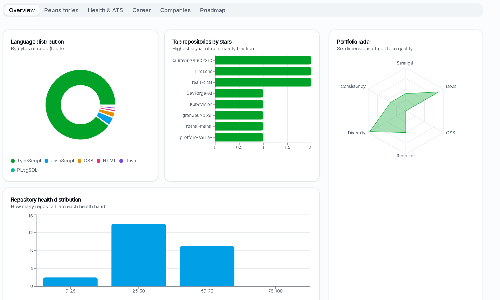
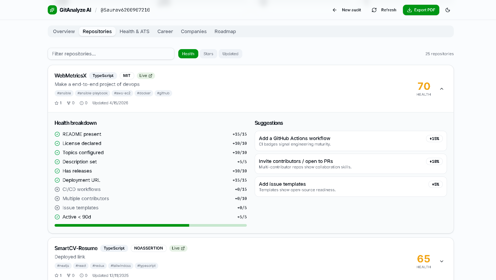
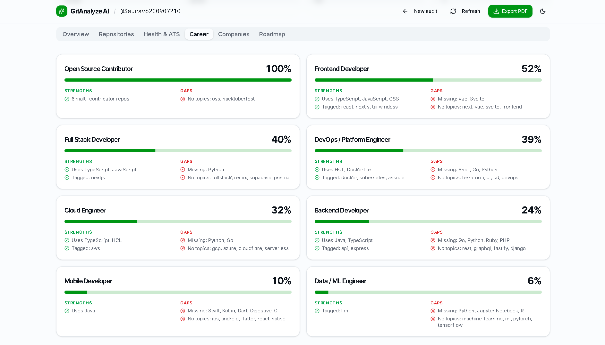
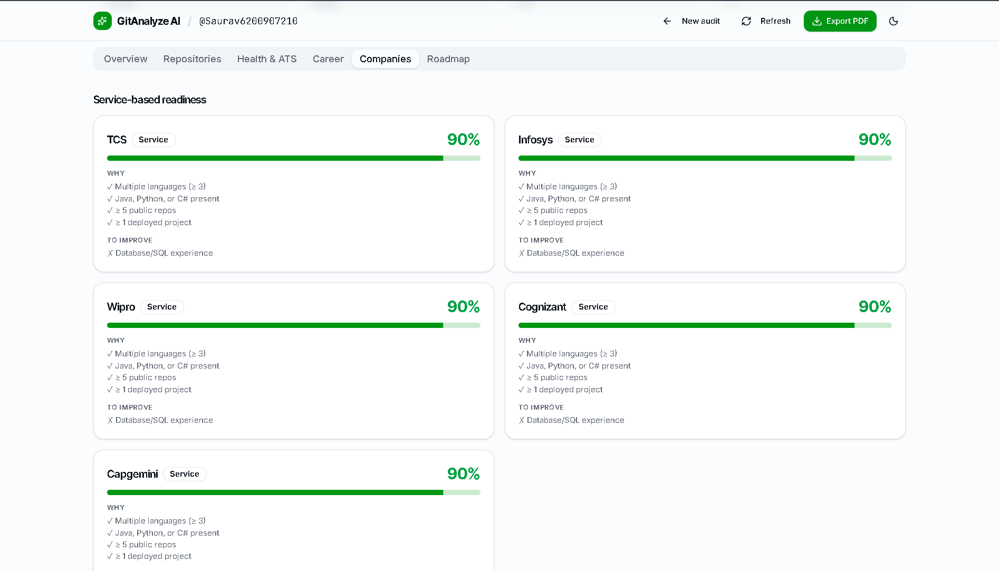
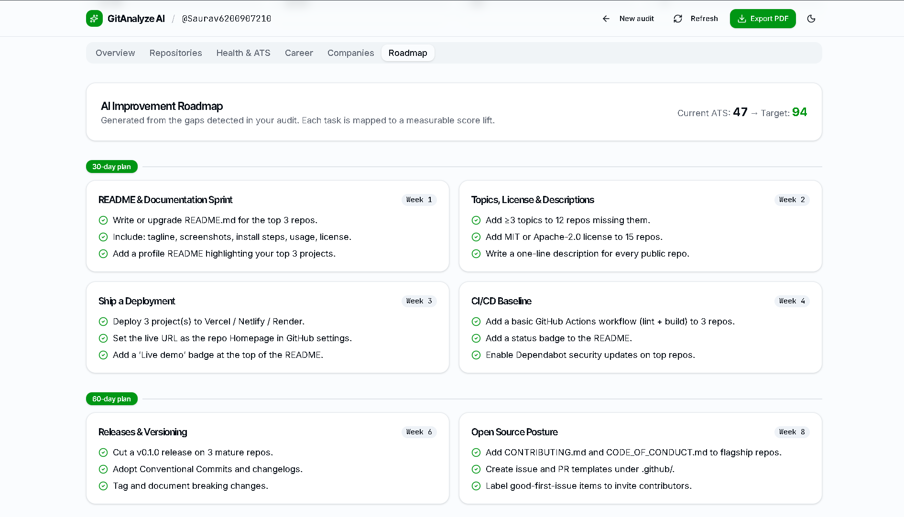

# 🚀 GitAnalyze AI — GitHub Portfolio Intelligence Platform

GitAnalyze AI is a professional full-stack platform designed to perform deep, actionable audits of public GitHub profiles. It grades repository health on software engineering standards, calculates an ATS-friendly readiness score, aligns developer profiles with career roles, and generates a week-by-week improvement roadmap plus downloadable PDF reports.

---

## 📸 Demo Walkthrough

Watch the application in action:

<video src="public/git%20project%20vedio%20copy.mp4" width="100%" controls autoplay loop muted></video>

---

## 🖼️ Feature Screenshots

### 1. Dashboard Overview
Detailed summary of public statistics, top languages, and developer strengths.


### 2. Repositories Audit
Audit metrics per repository grading READMEs, licenses, workflows, and contribution signals.


### 3. ATS & Portfolio Health Score
An ATS rating calculated based on recruiters' profile filtering algorithms.


### 4. Career Role Matching
Matching profile proficiency to developer roles like Frontend, Backend, DevOps, or ML.


### 5. Company Fit Matrix
Grading service-tier and product-tier compatibility based on open-source activity.


### 6. Action Roadmap
Week-by-week 30/60/90 day action items to systematically fix portfolio issues.


---

## ✨ Core Features

- 📊 **ATS Portfolio Score**: Heuristic score measuring profile optimization.
- 🩺 **Repo Health Audits**: In-depth checks on workflows, releases, READMEs, and contributors.
- 💼 **Career Matching**: Detailed alignment percentages against major tech jobs.
- 🏢 **Company Fit**: Analysis showing product vs. service tier hiring scores.
- 🗺️ **30/60/90 Day Roadmap**: Concrete, phased plan generated directly from audit gaps.
- 📄 **Dynamic PDF Export**: Browser-side PDF reports available in a single click.
- 🔄 **Redis Cache Refresh**: Manually purge user cache in Redis to pull fresh GitHub API metrics.

---

## ⚡ Technical Highlights

### 🏎️ 95+ Mobile Lighthouse Score
By lazy-loading heavy components (Recharts, React-PDF, and dynamic playground widgets) and removing Framer-motion from the critical initial render path, the main bundle size was cut from **1.7MB** to **198KB**, making page paint instant.

### 💾 Hybrid Caching Layer (Redis + Node-Cache)
Connected a **Dockerized Redis** cache on the backend. If Redis goes offline, the server automatically falls back to an in-memory **Node-Cache** system, guaranteeing zero-downtime cache lookups.

---

## ⚙️ How to Run Locally

### Option A: Running with Docker Compose 🐳 (Recommended)
This spins up the Redis container automatically.

1. Clone the repository.
2. Spin up Redis in the background:
   ```bash
   docker compose up -d
   ```
3. Run Backend:
   ```bash
   cd backend
   npm install
   npm run dev
   ```
4. Run Frontend:
   ```bash
   cd ..
   npm install
   npm run dev
   ```

---

### Option B: Local Fallback (Without Docker)
The backend will automatically fall back to using an in-memory `node-cache` if local Redis is unavailable.

1. **Backend**:
   ```bash
   cd backend
   npm install
   cp .env.example .env
   # Add your GITHUB_TOKEN inside backend/.env
   npm run dev
   ```
2. **Frontend**:
   ```bash
   cd ..
   npm install
   npm run dev
   ```

---

## ⭐ Support
If you find this project useful, please drop a star on GitHub! 🌟
